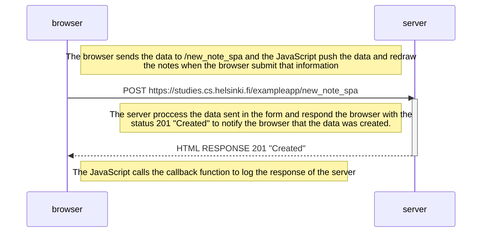

```mermaid
sequenceDiagram
    participant browser
    participant server

    Note right of browser: The browser sends the data to /new_note_spa and the JavaScript push the data and redraw<br/> the notes when the browser submit that information

    browser->>server: POST https://studies.cs.helsinki.fi/exampleapp/new_note_spa
    activate server

    Note left of server: The server proccess the data sent in the form and respond the browser with the <br/>status 201 "Created" to notify the browser that the data was created.

    server-->>browser: HTML RESPONSE 201 "Created"
    deactivate server

    Note right of browser: The JavaScript calls the callback function to log the response of the server
    
```